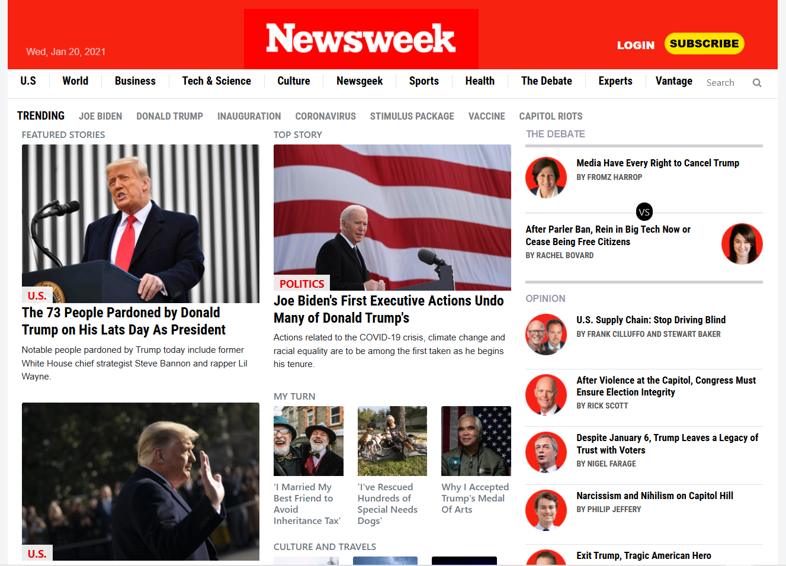

# Newsweek Clone

This project entails replicating the Newsweek homepage as it appeared on January 20, 2021, with the primary objective of mastering the Bootstrap framework's responsive design capabilities. By reconstructing a real-world, content-rich website, the project offers practical experience in implementing Bootstrap's grid system, navigation components, and utility classes to achieve a responsive and visually consistent layout across various devices.

## Built With

- HTML5
- CSS3
- Bootstrap

## Live Demo

[Visit the Live Demo](https://mhdez221993.github.io/newsweek-clone/)

## Authors

👤 **Teddy-Livingstone Ememandu**

- [GitHub](https://github.com/TedLivist)
- [Twitter](https://twitter.com/iamxted)
- [LinkedIn](https://linkedin.com/in/tememandu)

👤 **Moises Hernandez**

- [GitHub](https://github.com/Mhdez221993)
- [LinkedIn](https://www.linkedin.com/in/moises-hdez-coronado/)

## 🤝 Contributing

Contributions, issues, and feature requests are welcome!

Feel free to check the [issues page](https://github.com/Mhdez221993/newsweek-clone/issues)

## Show your support

Give a ⭐️ if you like this project!

## Acknowledgments

- Microverse
- StackOverflow