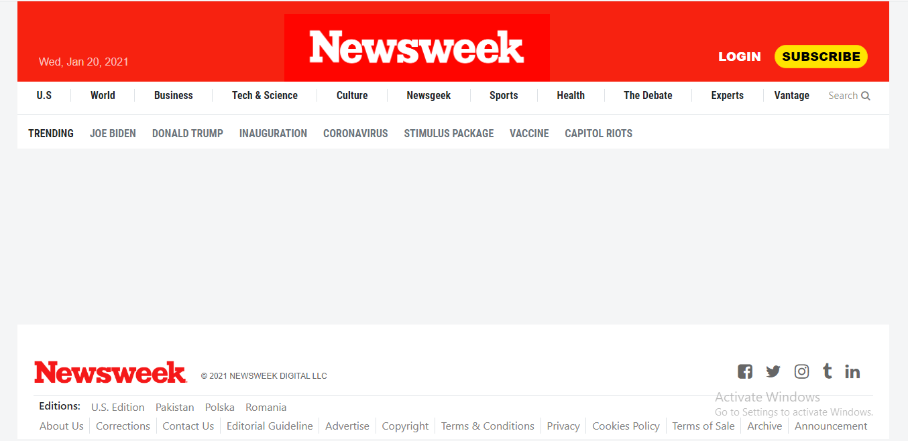

# Newsweek Clone

> This is a clone of an archived homepage of the Newsweek from 20 January, 2021
> The initial build of this project contains the header and the footer sections
> The main goal of this project is to learn how to use the Bootstrap framework, specifically its responsive design features



## Live Demo

[Visit the Live Demo](https://mhdez221993.github.io/newsweek-clone/)

## Built With

- HTML5
- CSS3
- Bootstrap
- Node Version 14.14

## Using Stylelint

This project uses **Stylelint** for CSS linting to maintain code quality and consistency.

### .stylelintrc Configuration

The `.stylelintrc` file is already included in the repository. It contains the configuration for Stylelint.

### How to Use Stylelint

1. Ensure you have Node.js installed on your machine.
2. Install Stylelint and its necessary plugins by running:

   ```bash
   npm install stylelint stylelint-config-recommended --save-dev
   ```

3. To lint your CSS files, run:

   ```bash
   npx stylelint "**/*.css"
   ```

4. Fix any auto-fixable issues by running:

   ```bash
   npx stylelint "**/*.css" --fix
   ```

## Authors

👤 **Teddy-Livingstone Ememandu**

- [GitHub](https://github.com/TedLivist)
- [Twitter](https://twitter.com/iamxted)
- [LinkedIn](https://linkedin.com/in/tememandu)

👤 **Moises Hernandez**

- [GitHub](https://github.com/Mhdez221993)
- [LinkedIn](https://www.linkedin.com/in/moises-hdez-coronado/)

## 🤝 Contributing

Contributions, issues, and feature requests are welcome!

Feel free to check the [issues page](../../issues/).

## Show your support

Give a ⭐️ if you like this project!

## Acknowledgments

- Microverse
- StackOverflow
